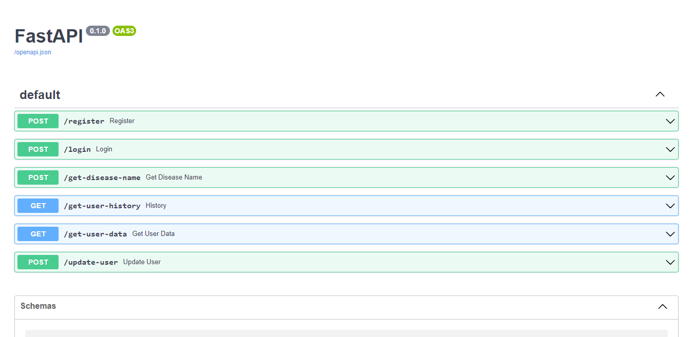

# AksaCarma BackEnd API

This is a BackEnd API for AksaCarma [mobile apps](https://github.com/AksaCerma/AksaCarma). Any push to this repository will be automatically deployed in GCP.

This API use python v3.8 for the support of [tensorflow docker image](https://hub.docker.com/r/tensorflow/tensorflow) and [FastAPI](https://fastapi.tiangolo.com/).

## Run This API

There are two ways to run this API locally. First, run directly in host, second, run in docker.

### Run in Host

* Clone this repo.

  ```
  git clone https://github.com/AksaCerma/aksacarma-cc.git
  ```
* Download machine learning model.

  ```
  cd saved_model/ml-aksacarma/variables
  wget https://storage.googleapis.com/variables-data-model/variables.data-00000-of-00001 -O variables.data-00000-of-00001
  ```
* Install the requirements.

  ```
  pip install -r requirements_local.txt
  ```
* Run the API.

  ```
  uvicorn main:app --port <your_port>
  ```

### Run in Docker

In this repo, there are two Dockerfile. You can download the [Dockerfile.git](https://raw.githubusercontent.com/AksaCerma/aksacarma-cc/main/Dockerfile.git) only or clone the repo and use the [Dockerfile](https://raw.githubusercontent.com/AksaCerma/aksacarma-cc/main/Dockerfile).

* Build the image.

  ```
  docker build -t <image>:<tag> --file <your_dockerfile> $(for i in `cat .env`; do out+="--build-arg $i " ; done; echo $out;out="") .
  ```
* Run the image.

  ```
  docker run -it -d -p <host_port>:8005 --name <container_name> <image>:<tag>
  ```

### Swagger UI

To access Swagger docs, you can use localhost:`<your_port>`. The docs will look like this. It contains endpoints information of this API.



## Environment Variables

The API needs to have environment variables to be used. The details of these environment variables are in the tables below. Please save this variables to `.env` file.

### API Keys

| Variable     | Detail                    |
| ------------ | ------------------------- |
| SECRET_KEY   | This API key              |
| GOOGLE_KEY_i | API key for Google Search |

This API needs five Google Search API key from 1-5 `GOOGLE_KEY_1` `GOOGLE_KEY_2` and so on.

### Database

| Variable | Detail                         |
| -------- | ------------------------------ |
| DB_HOST  | Database host (IP or hostname) |
| DB_PORT  | Database port                  |
| DB_USER  | Database username              |
| DB_PASS  | Database password              |
| DB_NAME  | Database name                  |

### Google Bucket

| Variable    | Detail             |
| ----------- | ------------------ |
| BUCKET_NAME | Google Bucket name |

## Database Tables

This API requires three tables to work on.

| Name          | Detail                         |
| ------------- | ------------------------------ |
| user          | User data                      |
| history       | Detect skin history            |
| search_result | Search result for user history |

The queries to create this tables are in [create_tables.sql](https://raw.githubusercontent.com/AksaCerma/aksacarma-cc/main/create_tables.sql) file. Please run the queries sequentialy.

## Service Account

This API need a service account to access Google Bucket. There are two ways to manage this.

* Use `SA_KEY` environment variable. Convert json content from [.json file to oneline](https://www.text-utils.com/json-formatter/). Save to `.env` file.
* Use service account .json file. Rename this file to `aksacarma-2e5f57e8e8c5.json`. (Recommended)
